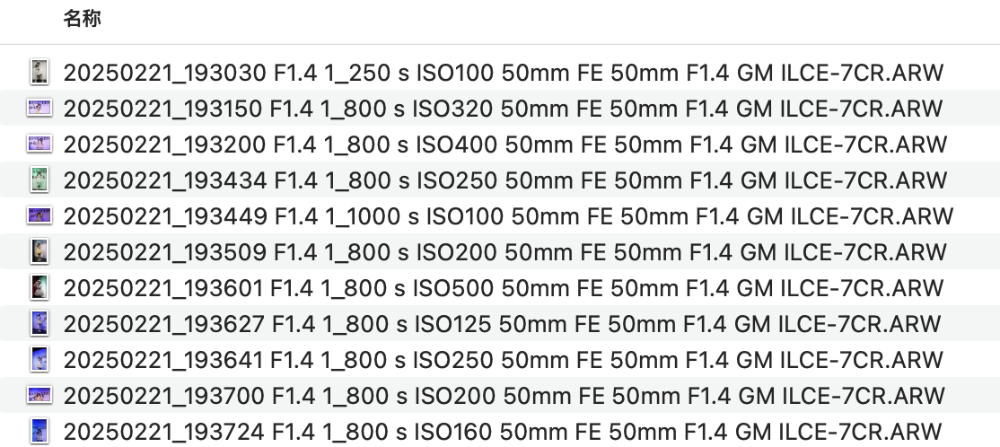

# 索尼ARW文件批量重命名

将给定文件夹下的 **.ARW** 批量重命名为 "日期-光圈-曝光时间-焦段-镜头-机型" 格式




**仅在MacOS下测试**


使用方法：

1. 安装exiv2
   ```brew install exiv2```


2. 执行  ```python main.py --path=文件夹路径 ```

例如：```python main.py --path=/Users/cyy/Desktop/图片筛选```